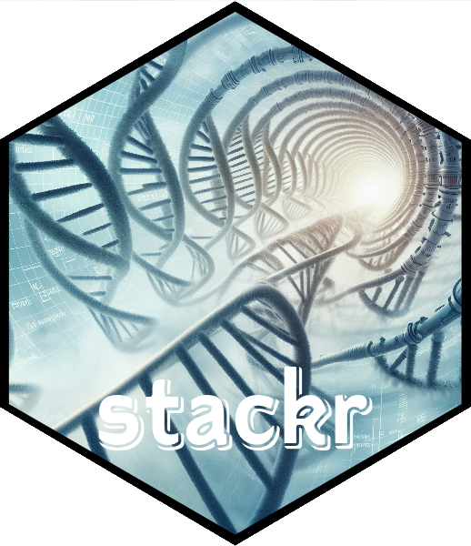
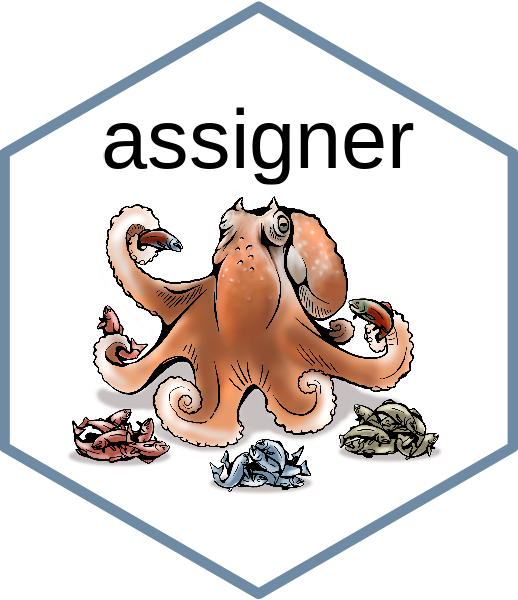

# standart <a href='https://thierrygosselin.github.io/standart/'></a>

<!-- README.md is generated from README.Rmd. Please edit that file -->
<!-- badges: start -->

[](http://www.repostatus.org/#active)
[](/commits/master)
<!-- badges: end -->

standart provides R functions that help you solve the most common
quality control challenges of genome reduction sequences (DArT, RADseq,
GBS, etc).

standart really shines in projects that requires consistency among
sequencing runs and when samples are from animals with large and
complicated genomes.

### Who is it for ?

The package is currently developed for projects at CSIRO.

## Installation

You can install the development version of standart like so:

``` r
if (!require("devtools")) install.packages("devtools")
devtools::install_github("thierrygosselin/standart")
library(standart)
```

## Overview

- Reads/sequences counter and length distribution.
- Read depth plot that highlights read coverage groups. Distinct and
  unique reads with high coverage are repetitive elements that when
  assembled in locus are usually paralogs, retrotransposons,
  transposable elements, etc.
- Noise reduction and fastq cleaning.
- Data normalization/rarefaction to remove or reduce ascertainment bias
  driving populations polymorphism discovery bias, missing data
  patterns, individual heterozygosity problems or patterns.
- Noise reduction and normalization will help to answer the question:
  are the differences between your samples: artifactual or biological.

## Getting help

- [Vignettes](https://thierrygosselin.github.io/standart/articles/index.html)
- [Computer setup and
  troubleshooting](https://thierrygosselin.github.io/radiator/articles/rad_genomics_computer_setup.html)
- My [github](https://github.com/thierrygosselin) as other packages to
  help in RAD/DArTseq analysis

[](https://thierrygosselin.github.io/stackr/)
[](https://thierrygosselin.github.io/radiator/)
[](https://thierrygosselin.github.io/assigner/)
[](https://thierrygosselin.github.io/grur/)
