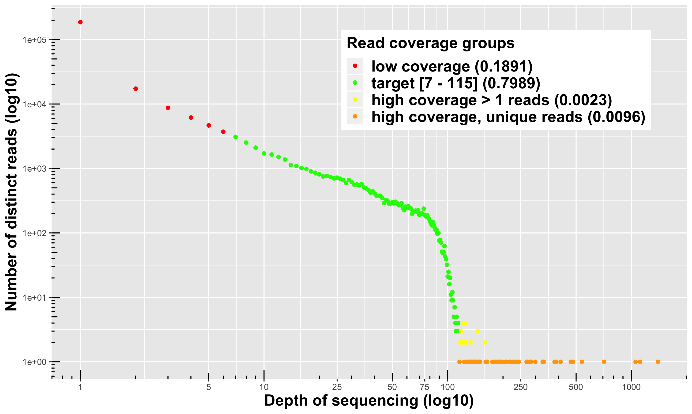

<!--  -->

```{r, include = FALSE}
knitr::opts_chunk$set(
  collapse = TRUE,
  comment = "#>",
  fig.align = "center"
)
```

The vignette purpose is to show users how to use standart, an R package that provides R functions to help solve the most common challenges of 
genome reduction sequences quality control (DArT, RADseq, GBS, etc). 

standart really shines in projects that requires consistency among sequencing runs and when samples are from animals with large and complicated genomes.


# Coding style

* standart is trying hard to follow the [tidyverse style guide](https://style.tidyverse.org).
* Inside stardart, using parallel execution is always through the use of the argument: `parallel.core`.


## Dependencies

* Make sure you have the latest R and RStudio version before installing stardart. 
My other package [radiator](https://thierrygosselin.github.io/radiator/index.html) 
as a nice [vignette](https://thierrygosselin.github.io/radiator/articles/rad_genomics_computer_setup.html) 
for this.
* Install stardart by following the [instructions](https://github.com/thierrygosselin/standart#installation).

## Quality control

I highly recommend running the sequencing files (entire lane or chip)
through a software dedicated for QC. If you have bad sequencing, 
no need to go further in the pipeline...


* [FastQC](https://www.bioinformatics.babraham.ac.uk/projects/fastqc/).
* [fastqcr](http://www.sthda.com/english/wiki/fastqcr-an-r-package-facilitating-quality-controls-of-sequencing-data-for-large-numbers-of-samples) is the R alternative.


### reads length

If you are using Illumina sequencing, chances are that you have 100 pb reads (SE RADseq). 
With Ion Torrent, the size will be highly variable and you have to determine the
optimal size to cut your reads to the same length, if the pipeline you are using 
for assembly requires it. Note that most pipeline that performs *de novo* assembly works better with uniform read length.

1. output of [FastQC](https://www.bioinformatics.babraham.ac.uk/projects/fastqc/)

[FastQC](https://www.bioinformatics.babraham.ac.uk/projects/fastqc/) will output
the read length distribution. But it's difficult to know how many markers you will
get depending on read size.

You will see the relationship between the position of the nucleotide on the read and
overall quality. This is very helpful to determine if you want to cut all your 
Illumina reads to 80 or 90 pb.


**Below is a FastQC figure of a typical Ion Torrent sequencing chip sequence length distribution:**


2. Use standart

Below is a figure generated by standart that shows the number of reads you will 
get depending on the maximum size threshold selected:


The function is:

```{r eval = FALSE}
size <- standart::reads_length_distribution(
  fq.file = "my-fastq.fastq.gz", 
  with.future = TRUE, 
  parallel.core = 12L
  )
```

You can use individual file or entire chip or lane. Function documentation: `?standart::reads_length_distribution`


**Remember that depending of types of file (individual or entire lane/chip:**

* Barcodes and adapters might be in this relationship observed in the figure.
* It's not uncommon to see increasing adapters present with increasing read size.
* Repetitive sequences, unique reads and so on might impact the results ([see noise section below](#noise)).


## Noise reduction {#noise}

Reducing the noise in an individual FQ file could really help speeding up your
analysis. I use it when I have more than 200 samples. Nothing new here:

* Daniel Ilut explains it in his pipeline (Ilut et al. 2014) and my function here
his basically the same as his but in R...
* Jon Puritz's [dDocent data reduction step](http://www.ddocent.com/UserGuide/#de-novo-assembly) as a similar example.
* Praveen's pipeline [RADProc](https://github.com/beiko-lab/RADProc) (Ravindran et al. 2019) use something similar.
* Metagenomic analysis pipeline all have some step of denoising the data.

### Visualization

I prefer Daniel Ilut way of visualizing the information. 

The function `stardart::read_depth_plot` requires 1 FQ file 
(after stacks *process_radtags* or `stackr::run_process_radtags`) and 
**is very fast to run**. It will highlight read coverage groups of distinct reads
within a sample. When I say distinct reads, is reads that are exactly the same, 
no mismatches. The distinct reads are putative allele.




**4 read coverage groups are shown:**

* **distinct reads with low coverage (in red): ** these reads are likely sequencing
errors or uninformative polymorphisms (shared only by a few samples).
* **disting reads for a target coverage (in green): ** 
  
  * Usually represent around 80% of the reads in the FQ file.
  * It's a *safe coverage range* to start exploring your data (open for discussion).
  * Lower threshold (default = 7): you could go as low as maybe 3 ?
  You can't escape it, it's your tolerance to call heterozygote 
  **a true heterozygote**. You want a minimum coverage 
  for both the reference and the alternative allele. Yes, you can use population
  information to lower this threshold or use some fancy *bayesian* algorithm.
  * Higher threshold: is a lot more open for discussion, here it's the lower 
  limit of another group (the orange, see below for description). Minus 1 bp.
* **distinct reads with high coverage > 1 read depth (in yellow): ** 
those are legitimate alleles with high coverage.
* **distinct and unique reads with high coverage (in orange): **
this is where you'll find paralogous sequences, transposable elements and other
high copy number variants.


To run it on your data:

```{r eval = FALSE}
read.plot <- standart::read_depth_plot(
  fq.file = "my-fq.fq.gz",
  min.coverage.fig = 7L, #default
  parallel.core = parallel::detectCores() - 1 #default
)
```

The function will generate the plot shown above and write the figure in the 
working directory, using the sample name: `my-fq_hap_read_depth.png`.

### FAQ

**Should I run the function on all samples ?**

Please don't. Their is no use in running this on the entire dataset. It's going to
be fairly the same. Run it on a couple of samples. Based on the number of reads
(distribution), choose 1 sample: below average, average and above average and compare the look of the figures produced.

### Filtering ?

Removing the noise in FQ files, it's usually a hot topic... Personally, the less
I do the better and it's definitely the case for small projects. 
I don't think the noise is a problem for pipline like stacks. 
For large projects, it's something else, and certainly a huge bottleneck.
When you generate *de novo* assembly for more than 2000 samples and generate 
a catalog with all the noise, cleaning the data can represent weeks of 
computation time that you shave off your project!

To test:

**1. Clean the FQ file**

Use the sample you just used in the read coverage groups, above, 
clean it with `standart::clean_fq`. It's very fast to run:

```{r eval = FALSE}
clean.fq.name <- standart::clean_fq(
  fq.file = "my-fq.fq.gz", 
  min.coverage.threshold = 2, 
  remove.unique.reads = TRUE, #default
  write.blacklist.fasta = TRUE,
  write.blacklist = FALSE, #default
  parallel.core = parallel::detectCores() - 1, #default
  verbose = TRUE #default
  )
```

This will generate:

```{r eval = FALSE}
my-fq_cleaned.fq.gz # the cleaned fq file
my-fq_blacklisted_reads.fasta.gz # a fasta file with blacklisted sequences...
```

**2. Run your *de novo* assembly pipeline**

Run your *de novo* assembly pipeline (e.g. stacks or stackr and 
do the next step below: *the mismatch threshold series* (using `stackr::run_ustacks`).
For this, use the raw and clean FQ files and compare the output...

In all my projects, having less reads (the cleaned FQ file) means:

* faster *de novo* assemblies (I've seen up to 3 times faster).
* less loci generated, but of better qualities:
  * higher coverage in all the *de novo* assembly steps of stacks
  * less repetitive stacks blacklisted
  * lower number of locus with assembly artifacts (lors of SNPs/locus, etc)
  * very similar heterozygosity and homozygosity proportions
* the mismathches plots are almost always identical: showing me that I can use 
the same Mismatch threshold (the `-M` in stacks *ustacks*) for the cleaned or the
raw FQ files.
* faster catalog generation time, the stacks *cstacks* or `stackr::run_cstacks`
step.
* NO DIFFERENCES in downstream analysis (population structure, outlier detection, 
Fst, assignment, closekin).


**Why keep the blacklisted sequences (the fasta file) ?**

You could use `Biostrings::countPattern` function to look for TE in those sequences;)

**3. Filtering the entire dataset**

If you see a big difference and are convince that filtering is the way to go, 
you can easily do it with this piece of code:

```{r eval = FALSE}
fq.to.clean <- list.files(path = "04_process_radtags/")
names(fq.to.clean) <- fq.to.clean

clean.all <- purrr::map_df(
  .x = fq.to.clean, 
  .f = standart::clean_fq,
  min.coverage.threshold = 5, 
  remove.unique.reads = TRUE, #default
  write.blacklist.fasta = TRUE,
  write.blacklist = FALSE, #default
  parallel.core = 12
)
```

Transfer the cleaned files or the raw ones in a separate folder/sub-folder
to keep things tidy.


## Data normalization {#normalization}

Another hot topic, up for debate...

After the stacks step called *process_radtags*, in stackr `run_process_radtags`,
looking at the distribution of the number of reads per sample, you might be 
getting one of these distribution:


In an ideal world, **you want the uniform distribution**. That translate in
good field and wet-lab techniques:

* tissue sampling and preservation
* extraction (robots ?)
* pipetting
* DNA quantification
* all the other required techniques

And this resulted in similar sequenced information between your samples.
You're about to compare apples with apples. :)

If you have a skewed (left or right) or a normal distribution, you'll be comparing
apples with ... citrus. The samples with lower reads will have less loci and usually
less heterozygous loci. Similarly, the samples with higher number of reads will
have more loci, more heterozygous loci. 

What's the likely cause for these ?

* student with no prior wet-lab experience doing the DNA extraction or downstream step (e.g. library prep)
* data preservation issues: historical DNA, fragmented DNA, etc.
* skipping the DNA quantification or library QC steps

Ok, but what's the problem with that ?

**Potentially these problems:**

* ascertainment bias that could drive populations polymorphism discovery bias
* missing data patterns
* individual heterozygosity problems or patterns 
* downstream analysis impacted by the differences between your samples: 
artifactual or biological ?

**Solutions ?**

### 1. Wet-lab normalization

Here are the basic steps:

* sequence the samples
* look at the stats we've discussed
* go back in the wet-lab to prepare a new plate
* sequence
* pool or not the lanes/chips
* look at the sequencing statistics
* repeat the step above or continue with the pipeline

I'm not a fan:

* Way to many wet-lab steps. 
* The wet-lab is **THE MOST** important part.
* Everything gets exacerbated with RADseq.
* I'm not in favor of pooling lanes or chips (more on this some day!).
* It's really not like working with microsatelites.

### 2. Bio-informatic normalization

When doing it right from the start is impossible, I prefer to do the normalization
after de demultiplexing step... after for example `stackr::run_process_radtags`. 
The prerequisite is to have enough sequencing material (reads) for all my samples.

The tool? [standart::normalize_reads](http://thierrygosselin.github.io/standart/reference/normalize_reads.html) function.

Rarefaction of fasq files by sub-sampling the reads before *de novo* assembly or 
alignment is not new:

* **Community and biodiversity ecologists** are well aware of species 
accumulation curves obtained with rarefaction (Sanders, 1968). 
The rarefaction method guarantees the samples have the same weight in the analysis.
* **Metagenomics community** before analyzing the alpha diversity will deal 
with differing sample depth for a given diversity statistic by using rarefaction. 
It means taking a random subset of a given size of the original sample 
(see [mothur](https://mothur.org),  Schloss et al. 2009).
* **Molecular ecologists** for some reasons, RADseq enthusiasts seems unaware 
of this concept, but see (Hale et al. 2009; Kalinowski, 2004 and Puncher et al. 2018).
* **The Keywords:** rarefaction, sub-sampling, normalization, standardization, 
sample size correction.

**The steps ?**

* the goal is to reduce variance in number of reads between samples
* rarefaction/normalization is conducted aon the fq file after stacks 
*process_radtags* and after removing the noise.
* normalized replicates are generated by the function by randomly selecting the 
reads (without replacement) for each samples
* you choose the number of replicates (default: 3) and you manage those replicates
like other replicates you might have (you want replicates...).

Read the [function documentation and look at the example](http://thierrygosselin.github.io/stackr/reference/normalize_reads.html#examples)

```{r eval = FALSE}
# To run this function, bioconductor's ShortRead package is necessary:
BiocManager::install("ShortRead")

# using defaults:
standart::normalize_reads(path.samples = "~/corals")

# customizing the function:
standart::normalize_reads(
   project.info = "project.info.corals.tsv",
   path.samples = "04_process_radtags",
   sample.reads = 2000000,
   number.replicates = 3,
   random.seed = 3,
   parallel.core = 12
   )
```


**My observations using rarefaction:**

* the replicates have similar mismathches plots: showing me that I can use 
the same Mismatch threshold (the `-M` in stacks *ustacks*) for the rarefied samples.
* better *de novo* assembly statistics
* when the individual or population heterozygosity **is a real biological signal**, 
rarefaction **doesn't impact the downstream analysis**.
* when the heterozygosity was driven by the sequencing bias, bioinformatic 
rarefaction took care of the problem.

#### FAQ

**It doesn’t bother you to throw away all the valuable information that samples 
with high read numbers have ?**

Absolutely not!

* **most of the information is already lost**: that is if you used stacks 
to generate a catalog and then filtered the data to keep markers in x individuals
and/or in all sampling sites/populations. At this step it’s either you loose 
markers or get more missing data...
* **It’s not a loss of information if the information cannot be confirmed with other samples:** it’s a statistic problem and ecologists are well aware of this.
* **The loss of reads is intrinsic to RADseq: ** Don't believe me, inspect 
stacks, stackr or any RADseq pipeline log files... Rarefaction is just another step, 
molecular ecologists are not used to it.
* check the total read depth of 1 sample after all the bioinformatic steps. 
Compare the numbers with the actual read number from the start of the pipeline. 
If you have > 30% you are lucky!

# References

Ilut, D., Nydam, M., Hare, M. (2014). 
Defining Loci in Restriction-Based Reduced Representation Genomic Data from Non
model Species: 
Sources of Bias and Diagnostics for Optimal Clustering BioMed Research International  2014(2), 1 9. 
https://dx.doi.org/10.1155/2014/675158

Rochette, N., Rivera‐Colón, A., Catchen, J. (2019). 
Stacks 2: Analytical methods for paired‐end sequencing improve RADseq‐based 
population genomics.
Molecular Ecology https://dx.doi.org/10.1111/mec.15253

Harvey, M., Judy, C., Seeholzer, G., Maley, J. (2015). 
Similarity thresholds used in short read assembly reduce the comparability of 
population histories across species 
PeerJ  3(), e895. 
https://dx.doi.org/10.7717/peerj.895

Ravindran, P., Bentzen, P., Bradbury, I., Beiko, R. (2019). RADProc: A computationally efficient de novo locus assembler for population studies using RADseq data Molecular Ecology Resources  19(1), 272-282. https://dx.doi.org/10.1111/1755-0998.12954

Schloss, P.D., et al., Introducing mothur: Open-source, platform-independent, 
community-supported software for describing and comparing microbial communities. 
Appl Environ Microbiol, 2009. 75(23):7537-41.

Sanders HL (1968) Marine benthic diversity: A comparative study. 
The American Naturalist 102: pp. 243–282 

Hale et al. (2009) on the relative merits of normalization and rarefaction in 
gene discovery in sturgeons. BMC genomics, 10, 203.

Kalinowski (2004) Counting Alleles with Rarefaction. Conservation Genetics, 5, 539–543.

Puncher et al. (2018) Molecular Ecology Resources, 44, 678.
